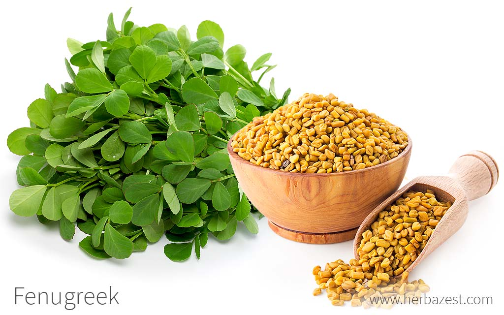
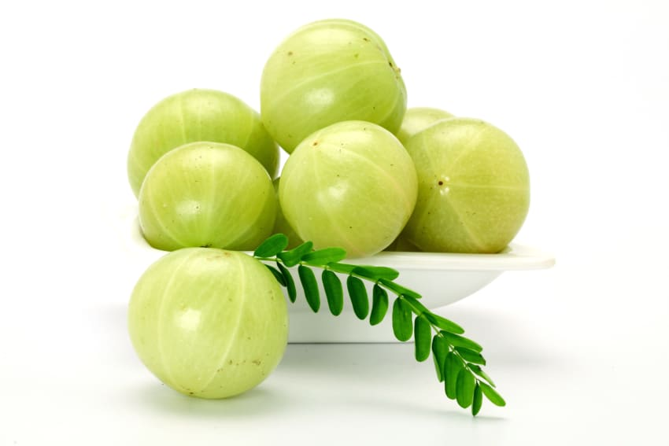

# Health & Lifestyle
About Health &amp; Lifestyle ...

## Coconut Hair Oil Preparation - to control hair loss & regrowth :man: :woman:

### Ingredients
#### Coconut Oil
- 1 or 2 liters of _*cold pressed coconut oil*_. Don't use off-the-shelf commercial cocunt oil that you get in supermarkets. 

#### Dried & powdered below ingredients
|  | Ingredient | | 
| :---         | :---      | :--- |
| :star: :star: :star:  |  | Methi (Fenugreek) powder made from Methi seeds after soaking, dried and powder. |
| :star: :star: :star: :star: |  | Amla (Gooseberry) dried powder. | 
  
-  
- Curry leaves.  :star: :star: :star:
- Hibiscus Leaves dried and powdered (Mandara) - Works as conditionar. :star:
- Mehandhi leaves (Gorantikau) :star:
- Aloveera extract :star:
- In case of Dandruff, add Cluster apple leaves. :star:
- In case of Dandruff, Neem leaves :star:

