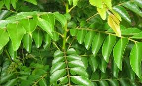
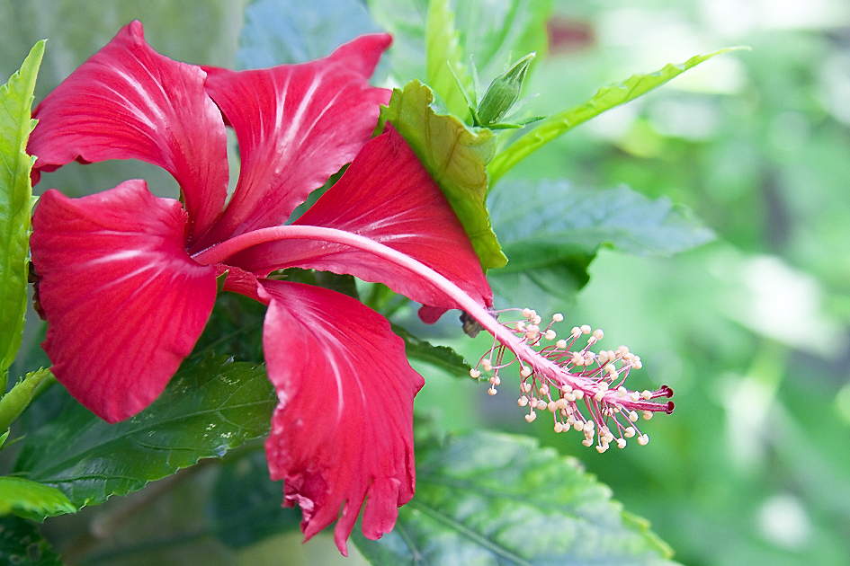
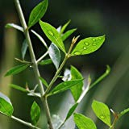
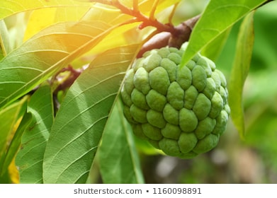
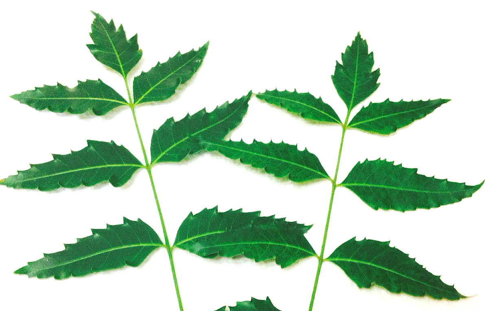
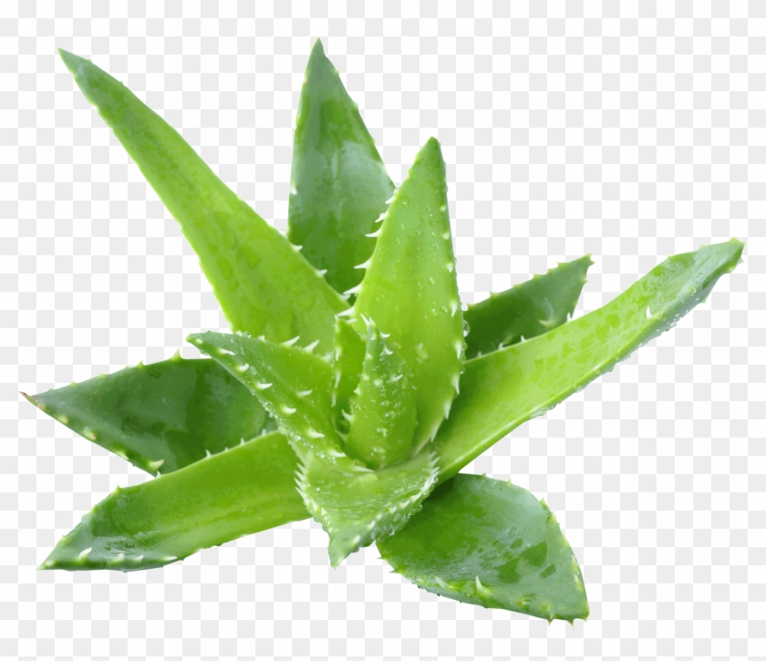

# Health & Lifestyle
About Health &amp; Lifestyle ...

## Coconut Hair Oil - to control hair loss & regrowth :man: :woman:

### Ingredients
#### Main Ingredient - Coconut Oil
- 1 or 2 liters of _*cold pressed coconut oil*_. Don't use off-the-shelf commercial cocunt oil that you get in supermarkets. 

#### Other Ingredients 
| Importance | Ingredient | Description | Purpose |
| :---         | :---      | :--- | :---      |
| :star: :star: :star:  |  | Methi (Fenugreek) powder made from Methi seeds after soaking, dried and powder. ||
| :star: :star: :star: :star: |  | Amla (Gooseberry) dried powder. | |
| :star: :star: :star:  |  | Curry Leaves || 
| :star: |  | Hibiscus (Mandara) leaves dried and powdered. | Acts as Conditioner |
| :star: |  | Henna (Gorintaku) leaves dried and powdered.| Acts as hair dye |
| :star: |  | Clustard apple leaves dried and powdered.|Reduces Dandruff|
| :star: |  | Neem leaves dried and powdered.| Reduces Dandruff|
| :star: |  | Aloe vera extract.| |

## Preparation
- Boil coconut oil along with above ingrdients in low flame for 20+ minutes
- Let it cool down sometime and filter oil with a strainer
- Use it!
